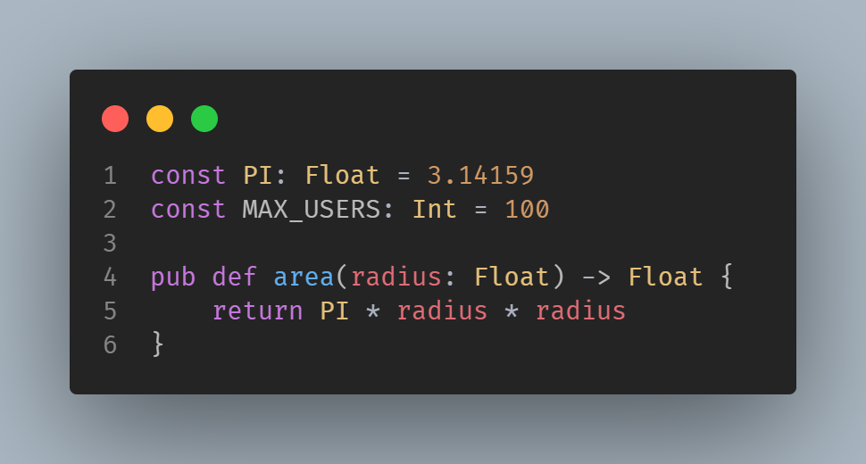
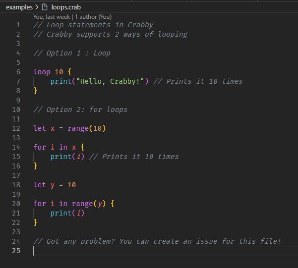

# 🦀 Crabby for VSCode

This is the official Vscode extension for [Crabby](https://github.com/crabby-lang/crabby), supporting syntax highlighting. Crabby icons files are still on the work.

You can read the Crabby Documentation [here](https://crabby-docs.vercel.app/)

It's on beta so many more improvements to come.
